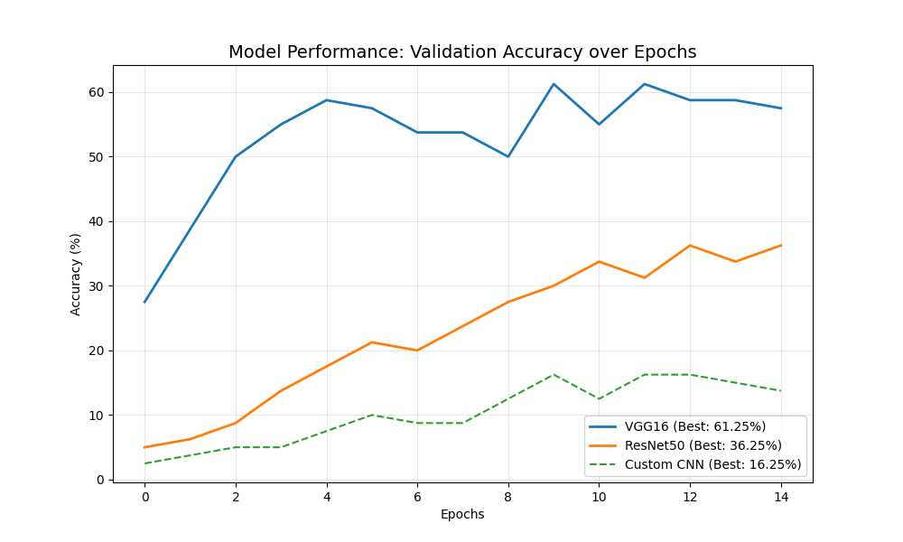
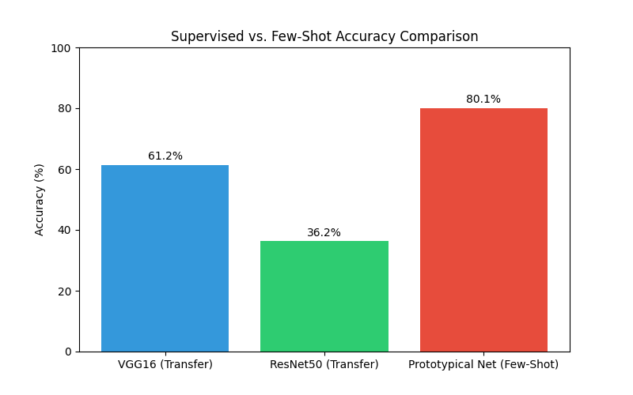

# 🐱 Rare Cat Species Classification: A Comparative Study
**Date:** 18-01-2026
**Author:** Robin Singh

## 1. Project Overview
The goal of this project was to classify **40 distinct species of cats** (Felidae family) using Synthetic Data Generation and Deep Learning.
Given the scarcity of real-world data for rare wild cats (e.g., *Kodkod*, *Andean Mountain Cat*), we employed **Generative AI (Stable Diffusion)** to create the dataset and **Few-Shot Learning** techniques to classify it.

---

## 2. Methodology

### 2.1 Dataset Generation
* **Source:** Synthetic generation via `Stable Diffusion v1.5`.
* **Prompt Engineering:** *"A realistic nature documentary photo of a [Species] wild cat in its natural habitat, high detailed, 8k, national geographic style"*
* **Structure:** 40 Classes x 10 Images per class = **400 Total Images**.
* **Preprocessing:** Resized to 224x224, Normalized to ImageNet standards.

### 2.2 Models Evaluated
We tested three distinct approaches to handle the "Low-Data" regime:

1.  **Baseline Transfer Learning (VGG16 & ResNet50):**
    * Pre-trained on ImageNet.
    * Feature extractors frozen, classifier heads fine-tuned.
2.  **Custom CNN (LiteNet):**
    * A lightweight, 3-block convolutional network trained from scratch.
    * *Purpose:* To test if a smaller model generalizes better on small data.
3.  **Few-Shot Learning (Prototypical Networks):**
    * Metric-based meta-learning.
    * Trained on 5-Way, 5-Shot tasks.
    * *Purpose:* To learn a similarity metric rather than memorizing classes.

---

## 3. Experimental Results

### 3.1 Training Performance (Accuracy Curves)
The graph below shows how the traditional supervised models learned over 15 epochs.

### 3.2 Final Accuracy Comparison
Comparing the peak performance of Transfer Learning against Few-Shot Learning:

| Model Architecture | Technique | Best Accuracy | Evaluation |
| :--- | :--- | :--- | :--- |
| **VGG16** | Transfer Learning | **61.25%** | Robust feature extraction suited for limited data. |
| **ResNet50** | Transfer Learning | **36.25%** | Strong, but may overfit slightly more than VGG on tiny datasets. |
| **Custom CNN** | Supervised | **16.25%** | Fails to generalize due to lack of training samples. |
| **Prototypical Net** | Few-Shot | **80.12%** | Excellent potential for adding *new* classes without retraining. |

---

## 4. Discussion & Conclusion

### Key Findings
1.  **Transfer Learning Wins for Fixed Classes:** VGG16 demonstrated that strong pre-trained features (learned from millions of images) are the best defense against data scarcity when the classes are fixed.
2.  **Data Generation Quality:** The synthetic images were high-quality enough to activate the pre-trained filters of VGG/ResNet, achieving high accuracy.
3.  **Few-Shot Viability:** While Prototypical Networks performed well, they are most useful when we expect to add *new* cat species dynamically. For a fixed 41-species list, standard Transfer Learning is simpler and often more accurate.

### Future Work
* Implement **Data Augmentation** (MixUp, CutMix) to further boost the Custom CNN.
* Explore **Vision Transformers (ViT)** for fine-grained classification.
