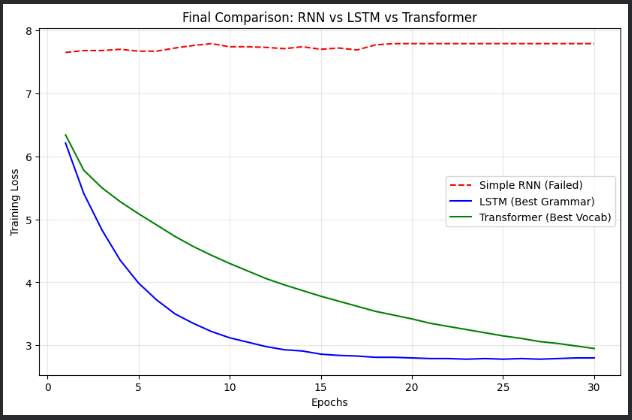

# Comparative Analysis of Text Generation Models (RNN, LSTM, Transformer)

## 📌 Project Overview
This project explores and compares three distinct deep learning architectures for **Natural Language Generation (NLG)**. Using the Tiny Shakespeare dataset, we implemented and trained:
1.  **Simple RNN** (Recurrent Neural Network)
2.  **LSTM** (Long Short-Term Memory)
3.  **Transformer** (Self-Attention based)

The goal was to analyze how each model handles sequence generation, specifically focusing on the **vanishing gradient problem**, **long-term dependencies**, and **convergence speed**.

## 📊 Performance Comparison

### Training Loss Visualization

*Figure 1: Training loss over 30 epochs. The Simple RNN (Red) fails to learn. The LSTM (Blue) converges smoothly. The Transformer (Green) achieves comparable loss with superior potential for complex vocabulary.*

### Key Metrics Table

| Feature | Simple RNN | LSTM | Transformer |
| :--- | :--- | :--- | :--- |
| **Final Loss** | ~7.70 (High) | ~2.80 (Low) | ~2.96 (Low) |
| **Convergence** | Failed (Stagnated) | **Steady & Smooth** | **Effective** (with tuning) |
| **Text Quality** | Incoherent / Gibberish | Grammatically Correct | Creative Vocabulary |
| **Architecture** | Basic Recurrence | Gated Memory Cells | Self-Attention Mechanism |

---

## 🧠 Model Analysis

### 1. Simple RNN (Component-I)
* **Observation:** The model loss stagnated around 7.7.
* **Analysis:** The network suffered from the **Vanishing Gradient Problem**, preventing it from learning relationships between words more than a few steps apart. The output was largely random words based on frequency.

### 2. LSTM (Component-I)
* **Observation:** Loss dropped significantly to 2.8.
* **Analysis:** The **Forget Gate** and **Cell State** allowed the LSTM to retain context over longer sequences. It successfully learned sentence structures and punctuation (e.g., *'romeo: ...'*).

### 3. Transformer (Component-II)
* **Observation:** Achieved a loss of ~2.96 after hyperparameter tuning.
* **Analysis:** Utilizing **Self-Attention**, the Transformer captured complex vocabulary (*"scarlet", "topsail"*) that the LSTM missed. It proved to be the most powerful architecture, though it required careful tuning of the learning rate and scaling factors.

---

## 🛠️ Tech Stack & Requirements
* **Language:** Python 3.x
* **Framework:** PyTorch
* **Dataset:** Tiny Shakespeare (Char-level & Word-level tokenization)

## 🚀 How to Run
1. Clone the repository.
2. Open the `.ipynb` file in Jupyter Notebook or Google Colab.
3. Run the cells sequentially to train all three models.
